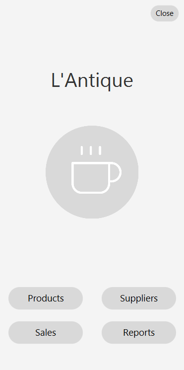
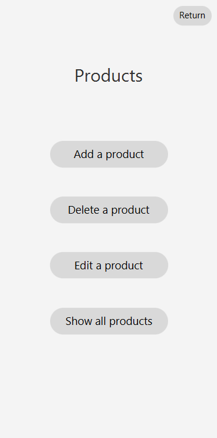
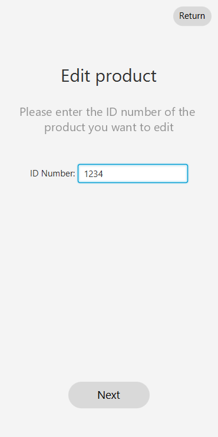
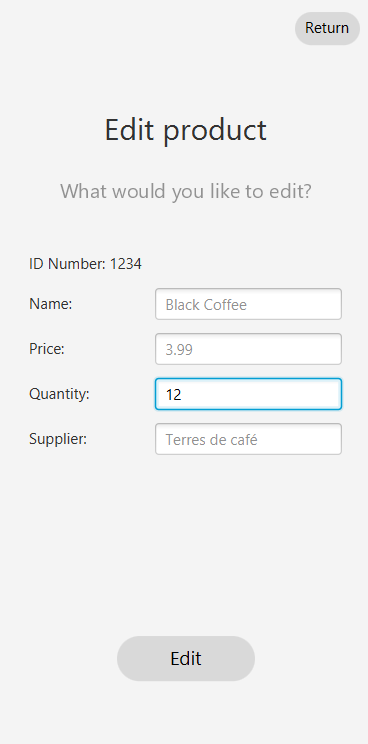

# Application de Gestion de Stock
 
## Description :
Ce projet est une application de gestion de stock de café, permettant d'effectuer des opérations 
CRUD (Créer, Lire, Mettre à jour, Supprimer) sur un inventaire de produits. L'application est 
développée avec Java, utilisant JavaFX pour l'interface graphique et une base de données SQL.

## Fonctionnalités :
Ajouter, modifier et supprimer les produits et fournisseurs;
Afficher la liste des fournisseurs et produits en stock;
Pouvoir les trier par ordre croissant, décroissant et alphabétique;
Enregistrer les ventes de produits et gérer les transactions;
Générer des rapports sur l'état du stock et des ventes.

## Comment utiliser l'application ?
### Prérecquis :

Il faut avoir installé sur son ordinateur :

- Java ;

- JavaFX ;

- MySQL ;

### Exécuter l'application :

Ouvrez le projet dans votre IDE;
Assurez-vous que le JDK Java 11+ est sélectionné dans votre configuration;
Vérifiez que JavaFX soit présent dans vos librairies;
Compilez et exécutez le projet directement depuis votre IDE.

## Screenshots:
### Home menu:

### Products' home menu:

### Add a product: 

### Edit a product:

