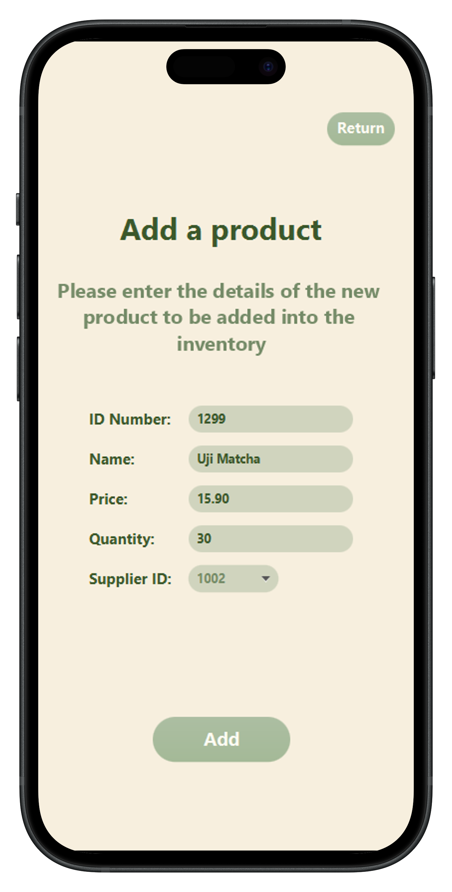

# Application de Gestion de Stock

## Description :
Ce projet est une application de gestion de stock de café, permettant d'effectuer des opérations 
CRUD (Créer, Lire, Mettre à jour, Supprimer) sur un inventaire de produits. L'application est 
développée avec Java, utilisant JavaFX pour l'interface graphique et une base de données SQL.
 
 
Lien vers la maquette Figma: https://www.figma.com/design/7DGJhtKYLpRDPshxSO6aHs/L'Antique-App?node-id=0-1&t=xzsyNejvFH34FWZj-1

## Fonctionnalités :
- Ajouter, modifier et supprimer les produits et fournisseurs;  
- Afficher la liste des fournisseurs et produits en stock;  
- Pouvoir les trier par ordre croissant, décroissant et alphabétique;  
- Enregistrer les ventes de produits et gérer les transactions;  
- Générer des rapports sur l'état du stock et des ventes.

## Comment utiliser l'application ?
### Prérecquis :

Il faut avoir installé sur son ordinateur :

- Java ;

- JavaFX ;

- MySQL ;

### Exécuter l'application :

Ouvrez le projet dans votre IDE;  
Assurez-vous que le JDK Java 11+ est sélectionné dans votre configuration;  
Vérifiez que JavaFX soit présent dans vos librairies;  
Compilez et exécutez le projet directement depuis votre IDE.

## Screenshots:

